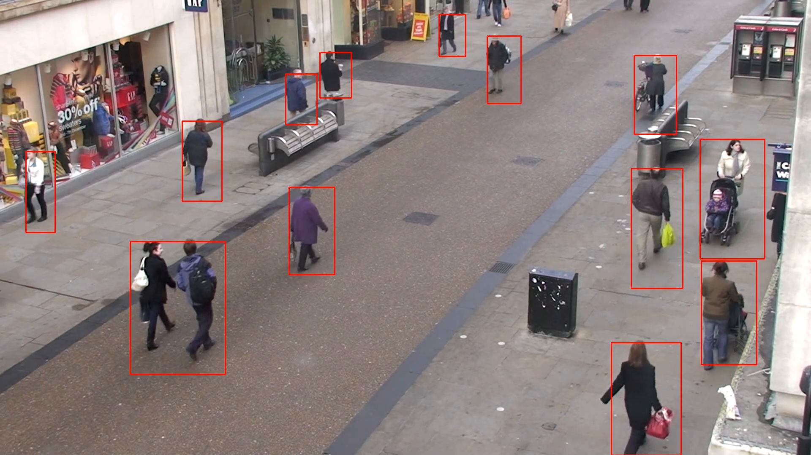

# Computer Vision Demos for the Xilinx ZCU104 Evaluation Board
This repository includes Jupyter notebooks which can be ran on Xilinx boards running the PYNQ framework.

This assumes you followed the QuickStart guide provided by PYNQ to setup the ZCU104.

As well as installing the [PYNQ Computer-Vision Repository](https://github.com/Xilinx/PYNQ-ComputerVision)

## Hardware Used:
1. [Xilinx ZCU104](https://www.xilinx.com/products/boards-and-kits/zcu104.html#documentation)
2. USB Webcam
3. HDMI cable and monitor
4. Ethernet

## Software:
1. [PYNQ v2.3](https://github.com/Xilinx/PYNQ/releases)

`tracking-demo.ipynb` contains an example for using Dense Optical Flow to track moving objects in a scene with a stationary point of view. The source video for that may be found [here](http://www.robots.ox.ac.uk/ActiveVision/Research/Projects/2009bbenfold_headpose/project.html#datasets)

Be sure to download that and change the path accordingly in the notebook.

